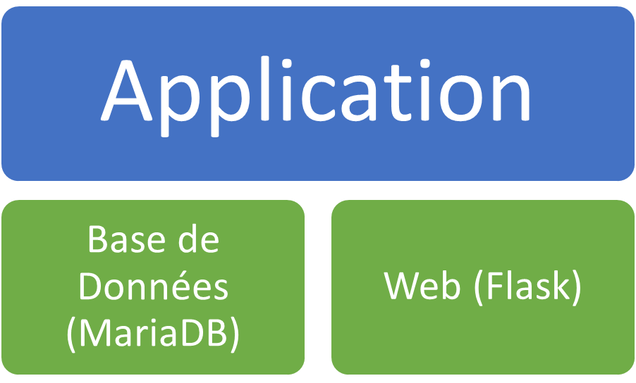

# Custolink 

## Antonio Camarillo Abad Cours DevOps (Docker)

**Contexte**
La société Entreprise Rossignol vous a missionné pour réaliser le développement et le déploiement de son tout nouvel ERP (CustoLink). Dans un premier temps, nous souhaitons mettre en place d’un POC afin de montrer notre savoir-faire et sécuriser le contrat.

**Travail à réaliser**
Un prototype d’application micro-services composé d’au moins page web affichant la liste des clients provenant d’une base de données. Ce prototype sera accompagné de son conteneurisation.

**Exigeances**
• La création de la base de données sera inclue dans le processus de déploiement (dump) 
• Assurez-vous que chaque fichier soient correctement documenté 
• Utilisez des produits Open Source

**Choix d'implémentation**
Pour la partie Web j’ai choisi Flask et html.
Pour la base de données j’ai choisi MariaDB.
Le prototype pour l’application est donc séparé en 2 micro services. L’un pour la partie web et l’autre pour la partie base de données.
Ci-dessous une image pour mieux l’illustrer




**Réalisation**
Pour mener à bien ce projet, j’ai procédé à créer un mock des données à l’aide du site : https://www.mockaroo.com/
Le fichier obtenu de ce site est un .sql que j’ai mis dans le répertoire du projet.

Ensuite j’ai réalisé les fichiers : 
* app.py pour flask
* le fichier des requirements
* Dockerfile pour l'image python
* docker-compose.yml pour faire un conteneur de  conteneurs
* client_list.html pour le rendu web de la liste


**Utilisation**

Suivez les étapes afin d'utiliser ce projet sur votre machine local

**Prérequis**

Avant de commencer, il faut avoir installé sur la machine cible:

* Docker: https://www.docker.com/get-started
* Docker Compose: https://docs.docker.com/compose/install/

**Installation**

1. Clone the repository:

```bash
git clone https://github.com/nharribou/IINF213.git
cd custolink

docker-compose up --build

```  
Ces commandes permetteront d'avoir le projet sur votre machine en local et de créer les images nécessaires, en créant aussi la base de donnée à utiliser, créer les conteneurs et les démarrer.

**Accéder à l Application**

* Web Frontend: http://localhost:8000/

**Usage**

* Le  dossier `app` contient le code flask en python.
* Dans le dossier `app`, le dossier `templates` contient le code html.
* Le fichier `client.sql` situé à la racine contient le script pour la création de la base de données des clients.

